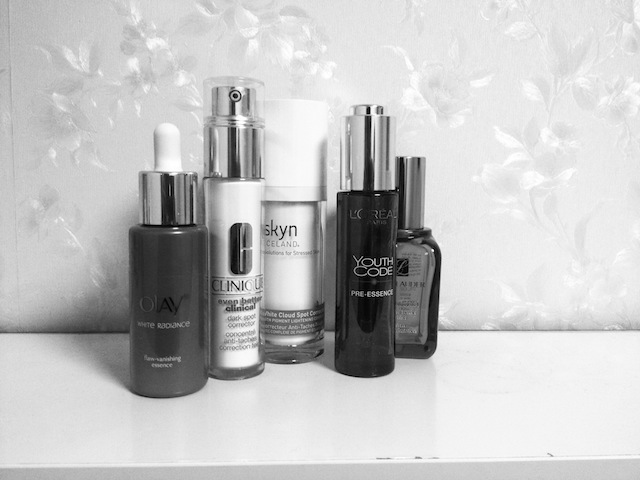

# 瓶瓶罐罐又一年

首先。可真是一片chaos哇。

这一句是2013年总结的第一句，也可当做最后一句。

事无巨细写2013年发生的事情，我不好意思拉不下脸。那就随几幅图，随一点小兴趣，随便勾勒下2013的轮廓吧。也因为小兴趣再不记录，基本随着时间淡去，兴趣聊胜于无，人生变得好可怕。

脸倒是一天两遍的洗，却没用出几瓶来，多数是因为前年一次买了三块卡米拉。依次用掉了，薰衣草，天竺葵，茉莉的目前也开了，遥遥无期中。薰衣草12年洗澡用完了，13年开了天竺葵，八成在我住在伊斯兰教区时洗脸洗澡洗衣服用掉了。尸骨无存。打起泡沫非常费力，揉很久手里也没东西，味道各有各的好，唯独茉莉是肥皂味儿，属于用起来新鲜，没成就感的东西。估计不会再入了。

还用掉些洁面。美加净葡萄柚泡沫，旁氏洁面泡粉色，Suki洁面胶，Liz Earle洁面膏，大宝若干，肌研一只。还有什么实在想不起来了。那就暂且说这几样。都说洁面泡怎么方便好冲淋省事，好用的平价类我也试过不少了，觉得很是了了，表活是氨基酸两性的往往泡泡很虚，其他表活的都很涩，应该没什么特别的需要不会再入同类了。洁面胶和洁面膏一直是我的心头好，洁面胶通常都柔柔软软，只要不是SLS的表活都很可人，洗完刚刚好，有点残留的感觉通常更妙；洁面膏厚厚的非常丰富加上精油浓郁或淡的味道都甚是美好。当然Liz Earle的洁面膏对我而言是相当不可替代，Suki的洁面胶有点过于清甜，不过价格美丽也很加分。洁面胶的100分永远都是清妃柔白，14年如果入，就是她了。洁面膏贵的蛋疼，再想，也只能意淫了。

洁面的题外话：能记得起，在图片中的，都是回国后的空瓶了。在UK时无数美丽的产品被我用过之后弃如敝履，忘得干干净净。现在好东西要么是带回来的囤货，要么是当下的便宜代替品。了无生趣，杂草丛生，彻底屌丝，实在伤心。生活质量的下降，情理之中意料之外，速度太快始料未及。太快混进了超市流，太早放弃了一众心头好。偶尔拉开抽屉看看舍不得用的小东西，舍不得放下的旧生活。痴枉一笑。得过且过。

继续。

万物之水。印象中(图中没有)最好用的应该还是comvita的蜂蜜水，非常滋润，不仅解渴也顶饱的东西。Melvita 的玫瑰精露有点高机能的意思，也好。Aesop喷雾味道让我如沐如醉，如果不考虑单价的话。再下来就是羽西生机水，原价没劲，50一瓶确是极品。Merlort葡萄水有色素貌似，太普通了，只有量大一个优点。美加净翠竹和蜂蜜对得起超市的价钱。14年高机能类的基本放弃，没什么意外基本都用矿泉水喷雾了。50一瓶的依泉很对得起我。

水的题外话：这东西很没用。不过帝都的市政用水不讲究。这一步也不算多余。

精华serum。最好用不能被我的驴脑子忘记的，就是EA的白手套了。真的有亮白，而且滋润舒服，挤起来好玩，能兼顾这么些功能的好东东，夫复何求？图中没有。图里的Clinique dark spot corrector, 作用没发现，只能说，还好？Ice land corrector送了眼霜，小众圣品这么划算还是让人很满意，只是似乎好像也没多大用？补水打底的精华若干，小棕瓶忘记了今年有没有用，同牌蓝瓶用了一瓶，打底平滑毛孔还可以，不过以后应该没机会入了，25胖子这种价只存在那一两个地方。L’oreal小黑瓶用了两瓶，无话可说。Clinique小白瓶，用了一瓶，第二瓶正在进行，配方略干净，水嗒嗒的精华里这个感觉最好。有机会还入。

Serum题外话：囤货要弹尽粮绝了。14年堪忧。

眼部。味道与欲望是紧密相连的。至少在我这里是这样。眼部的乱七八糟折腾几年，有印象的不是因为有效，而是独一无二的味道。Aesop parsley eye serum绝对就是这样，说不上来的青草嫩叶微浓的混合味儿，用了再用用了再用，直到没得可用。沦为屌丝后，基本不再能直视，只能遥想公瑾当年了。Lancome小银瓶趁半价买入，了了。Ren的理念特别好，包装细长，真空按压，工业设计的各种精妙。30ml的Clinique intense eye cream虽然如老太婆的缠脚布，逡巡了一年才用毕，可还真是越用越有味道。不知道用什么合适，那么这个真是老少咸宜，四季合意。18块的秀丽韩，和merlot一套顺手带的，像太妃糖一样，味道很怀旧复古，非常老式的脂粉香，有点老上海，很适合玩玩看。

眼部题外话：还有几瓶老陈货。14年缝缝补补又一年了。

面霜。最安心的一步，囤货最多的一步。最惊喜的不是什么囤积的经典，反倒是孩儿面植萃面霜，蓝蘑菇看起来仿佛有毒，不过用起来还是很惬意的。什么都只能用刚刚好来形容。还会再入入入的。当然如果14年用得完那5678瓶。欧叔叔腊菊美白霜，了了，搓泥。旁氏蓝白双瓶，维生素B3还是挺猛的，有便宜会再入。然后就是永远的爱Aesop camellia nut hydrating cream了，味道，使用感，包装，理念，配方，全部都是我心中的完美。用完的每一个120ml都是依依不舍的结束。再入有望。

面霜题外话：每个夜晚的结束，都是这一瓶来宣告的。真不知道没有这最后一抹我还能不能睡得着觉。

其他。大致只剩下防晒之类的了。大宝防晒用了两条，碧柔用了两条，小白管子的很赞。美加净一条。欧莱雅一条。Orbis一条。Allie一条。差不多就这样了。冬天还消耗了少许身体及手部的东西。Make-up基本没有用完的，除了Givenchy九宫格散粉和EL美白散粉，防晒了总是要用粉压压的。基本只能再入散粉了。

其他的题外话：粉真的太厚吗？如果厚了就当防止毒气入侵吧。我是奥特曼。

写下来真好。感觉分类了去年的垃圾。也预制了今年的消费计划和风向。最关键的是一柜子的烂东西可以收拾扔掉了。What a relief!争取以后三个月就review空瓶一次。当然这也得看用了多少。
