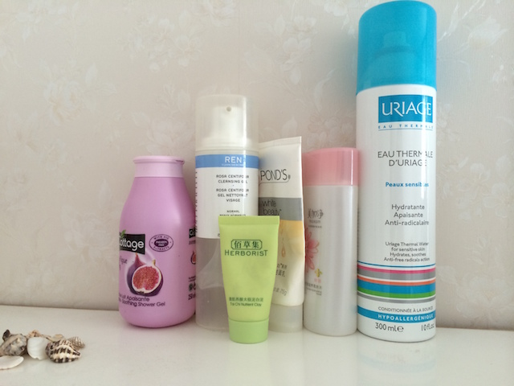
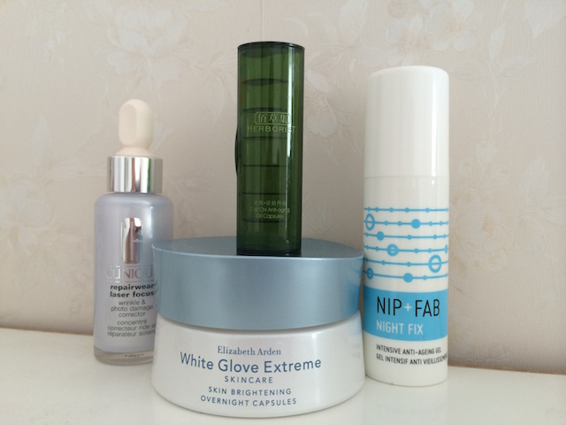
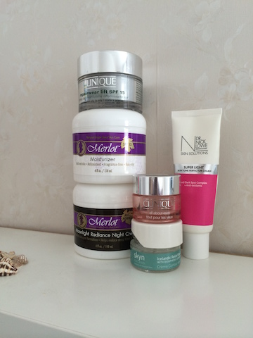
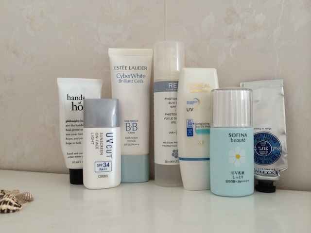

# 夏至未至

偷闲的周三。在家轻轻松松起床，收几个沁人心脾的快递。更换床单被罩。榨一杯西柚。打开空调，关闭门窗。安静安静安静的世界。

上次说的三个月review一次的瓶瓶罐罐，结果以瓶罐太少而失败。枉我自称小达人，半年下来也就用了那么点东西。下面就记一下流水账吧。

## 清洁部门

真的好少，怎么这么少。可能还是不小心扔掉了不该扔的。从右至左。

依泉喷雾，京东半价收的，喷嘴比雅漾更好一些。味道咸咸的。

美加净蜂蜜水，老妈剩的，味道大，有点高机能水的意思，比较粘稠，挺经用。

旁氏米粹洁面，氨基酸表活，10块一根，出差用了一年也没用完。忧伤逆流成河。

REN玫瑰洁面，回国的老囤货了。很喜欢的味道，非常自然，真空按压，洁净力适中，早晚都能用。囤囤囤的备选。

Cottage浴液，无花果口味，有点奶油，屈臣氏购入，随便用用的好选择。

佰草集黑泥貌似被我扔了。不好用。黑色白色都不是泥巴，都是胶水状的，没什么吸附力，清洁不出任何黑头白头，也干不了，非常纠结的产品，不会再用。坚决抵制。用这个太极泥的同时也试了几个其他的产品，都是名声在外，我不用动脑立刻可以得出同价位功效使用感更好的同类产品。基本这个牌子也不会再碰了。

## 精华部门

怎么用了这么少，奇怪。每天消耗量都非常大，不知道用到那儿去了。从左至右。

Clinique laser focus,回国囤货的最后一瓶，没有合适的价格了，虽然是质感最好的DNA精华，可是应该很少有机会还能买到合适的了。

佰草集的太极丹，在上面清洁类也说了，佰草集这几个拳头产品我都非常不enjoy。这个太极丹跟雅顿的白手套类似的产品，但是胶囊做的不好，内容物也很难吸收，一周下来没有任何变化。不会再买第一名。原价也是相当辣手的。

Elizabeth Arden白手套，非常喜欢的产品之一。半年不用时常会想念的好物。提亮肤色，润泽纹理，有效果，有白菜，有良心的好产品。囤囤囤的必选。

最右的就是NIP+FAB night fix，含有A醇，配方好看的好物。不过用了三月有余也没看出效果，但也不刺激。价格十分美好，可以打80分了。

## 面霜部门

Merlot这两大罐，日霜晚霜个100ml多，用了一冬天加一春天好不容易才见底。晚霜优于日霜，打底滋润保湿都不错，很干净的配方。日霜所谓的防晒应该是机会没有，跟有些防晒有点搓泥，保湿也一般。

Clinique laser focus lift SPF15，这罐很好用，其实Clinique家的面霜都十分好用，鸡尾酒配方虽然不简洁，也不见得有效，可是怎么用都不会出问题。只要价格美好，就可以回购的好物。

中间两瓶眼霜。上面也是Clinique all about eyes，早上用，用了大半年好不容易用完，几乎无感了。下面的Skyn Iceland的眼霜，当初买满45镑就免费送的。拿回来才发现是绝顶的好产品，立刻有沾了大便宜的感觉。耐用，摩丝质地，触眼就化。可惜最后摔坏了瓶盖。应该也不会有好价格了。再买真难。

Dr. Nick Lowe是英国的一个医生牌子，价钱不贵，产品不多，讲究功效。这瓶是主打阿魏酸的，每次用美白精华，用这个促进一下还是很不错的。第二瓶了，奶油质感，用起来嗖嗖快，好像两个月就没了50ml。也是一样的，回购很困难。

## 防晒部门

这边算是多了吧。用防晒还是必须要狠一点的。从左至右。

Orbis UV cut这个是常备款，柔焦毛孔，控油对混合皮是很管用的。新款也有了，颜色发灰，有点厚重，不如这个黄色调的好用，应该囤一些老款，嗯。

Estee Lauder Cyber White BB，这个是第一次在机场免税店挥霍的结果，来来回回也用了近三年了。50ml的粉底类真的很难用完，最后已经没有爱了。

Ren的纯物理防晒日霜，质感太棒了，丝丝滑滑，绸缎感。用完了就想，还想要，没途径入。当然防晒效果只能当做加成产品，不能当主力。

L’oreal 的这款防晒，冰凉肤感，有小颗粒，本来成分不错，是个主力军。结果结果，好搓泥啊。跟什么都搓，小颗粒也不融化，非常捉急的产品。不会买了。

Sofina Beaute蓝小花，日系摇摇乐，用尽一切办法一个月用完的，质感还行，但不知道为啥别人都说清爽，但我用摇摇乐总是有点油，等它干大概需要10分钟，之后上妆什么的都没问题，薄荷味儿也清爽，成分要是再up一下就更好了。不算便宜，但还是不错的。还有三瓶在路上。

差不多就这些了。无感的半年。很忙，用了很多旅行装，没太上心在护肤上，也不碰彩妆了，几乎长毛的节奏。最近又连着发痘痘。心态不好，身体不好。感觉一切都不好了。心里经常堵着，水泄不通。生活的无力感，不可控感，充满了各个方面，包括我擅长的护肤。该捡起什么放下什么，心里完全没谱。

所以今天清了柜子，用完的都扔掉了。

让我再看看，可能再扔一些吧。
