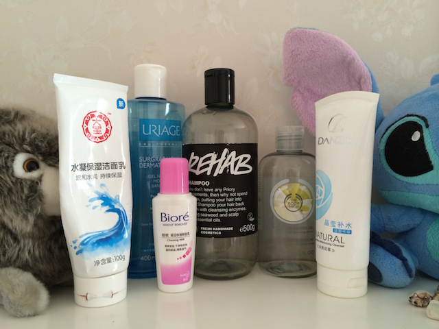
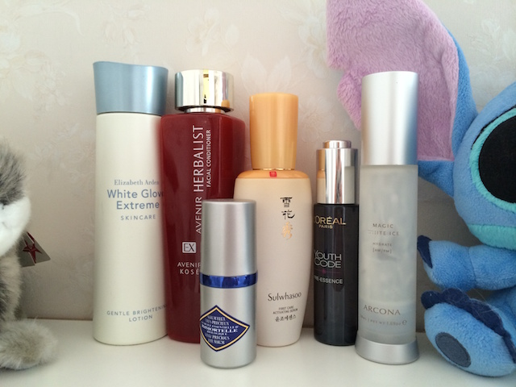
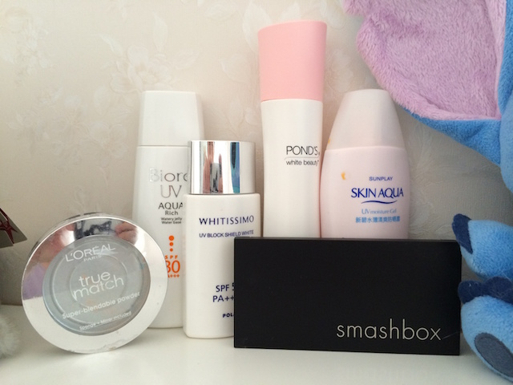
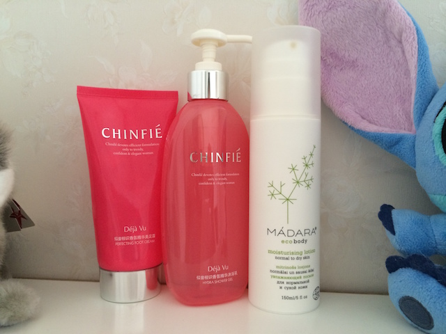

# 狮子座的尾巴是处女座

每次清理柜子，清理垃圾，清理回收品，争当处女座的时候都是柜子已满，夹缝好脏，门后面实在放不下了，这大可以说明人就是不逼急，不见棺材，不被作死，不是不得已的时候，就不会好好做人，好好生活，勇敢上进了是不是？其实我隐蔽的懒癌也绝对秒杀一般病友，只不过我大水瓶通常开水浇下来也是镇定的，冰桶又算什么，懒又算得了什么呢。

废话不说，上次更新空瓶是两个月前，时隔两个月其实没少用啊，但是空瓶并不多，原因大概是几个大件买了替换装所以没有瓶子生下来，拍的时候也忘记了。所以，有多少就来多少吧。

依旧老顺序。

Cleanser：

Dabao hydrating milk wash cleans very well without drying the skin too much, and leave the skin smooth and soft, and the price is very reasonable, why not have one on your wash basin?

自从大宝改了经典圆筒洁面的配方，好像总有哪里不太对，没有以前那种厚厚的滋润感了，略遗憾，刚好出了新款，一看配方大喜，用了之后就变生力常备军了。毫无疑问肯定是陪伴一生的牌子了。

Uriage surcharge cleanser is so gentle that it’s not clean enough in summer. But it is very light weighted and the capacity of 200ml lasts forever.  I bought it half price online with the mineral water spray mentioned in last post which is very good.

依泉这个保湿洁面就是上次跟两只依泉喷雾一起买的，依泉喷雾很爱，这个真的一般，过于温和还很大一瓶，夏天洗过像没洗，还很涩，肯定不会再买了。用之前的雅顿的泡泡瓶做成泡沫洁面，还在凑合着用完，估计还得两个月。

Biore make up remover is a free sample from Watson last year with the sunscreen. Acceptable cleaning with fair price, may buy it again sometime.

碧柔卸妆乳小瓶出差很方便随便的底妆淡妆轻松搞定，大瓶也用过不少，内地平价卸妆的先驱了吧，拯救了我的大学时代，蛮有感情的。

丹姿的这个有点玫瑰味儿，洗澡不错，洗脸不太敢用。不多说了。

Lush rehab shampoo, bought in HK this year. A re-buy product with good smell and good cleaning function is a must have, and combine the good memory of myself in UK. Love it!

Lush rehab 洗发水用了很多很多了，每次都是最大罐，在英国时太容易得到没怎么仔细比较过，现在用了太多国内的超市线，才发现有正经橄榄油，薄荷油实实在在无硅SLS的洗发水已经难能可贵。其实还没用完灌进压嘴瓶了。

The body shop moringa shower gel smells so good and lasts forever with full house of the flower aroma, the smell relax the body and mind, and the HKD 25 allows everyone to have every scent.

TBS 味道太好闻，以前在英国看不上的牌子在香港碰到25港币还是无耻的入了，没办法穷人的日子穿衣嫌长吃饭嫌多，精细着来。味道非常霸气可以持续一晚，洗完整个人整个房间都是香的，放松的感觉幸福的感觉也是满满的。

Toner and serum：

Elizabeth Arden white glove toner, from the set with the capsules, has soap scent and cleans the left cleanser.

EA 白手套的水，总体还可以，开口很可怕，用完没什么感觉，可是同系列的胶囊必须是一生的爱，不再赘述了。

Kose Avenir herbal conditioner with the big name of  fairy water, with alcohol, cleans the dead cells after cleanser, make skin soft and  tender, with better absorption afterwards.

高丝艾文莉的水，俗称小雪水了。湿敷一下还是不错的，平时擦起来酒精味很大，夏天用起来还是不错的。

Sulwhasoo first care activating serum is the first step after cleaning, but I always use it after toner. It has a special herb or drug aroma in this brown liquid. 90ml lasts for more than 5 months with only once a day. So far I haven’t inspect any surprising effect.

雪花秀润燥精华，大名鼎鼎，初次尝试，也算是年初买的和BB气垫一起，90ml最后也是无聊极了，大概不会再买，不算便宜，假货多，又难买，明显的效果也没有。瓶子质感不错，味道不错，就这样了。

L’oreal youth code pre-essence is the fair price edition of lacome genefique essence. Bought it half price online, a very good morning serum with no great effect, but a good moisture effect, and a very good ingredient of homemade BB cushion.

欧莱雅这个也是第二罐了吧，一次在京东买的，出差专用，后来不出差了，偶尔加料在BB气垫里也算是用完了，无功无过，早上随便用用不搓泥。

Arcona magic white ice is a all day antioxidant serum for oily and oily combination skin. It also works well on me. with a smell of blueberry yogurt, it is really attract me to use more and more every morning. 50ml lasts for only 3 month with once a day can prove my love. Already open another one.

Arcona 白冰，今夏的新宠，想买一只美白精华，研究到杜鹃花酸的时候发现的牌子，看到这款居然更红就忍不住跟了风，ok， 我不会承认我这个是没法接受一次只买了一个东西，所以才买了白冰的。好吧，味道好闻，保湿力可以，抗氧化力赞，持妆力都升级了耶。以后要常备了，特别棒。

Sunscreen  and powder：

Biore aqua rich sunscreen is very light and easy to absorb, with a slightly amount of alcohol.

碧柔白瓶便宜好吸收的身体防晒，无他。

Pola  whitissimo sunscreen is the new love this year. It is perfect for face without drying up the skin or stays a thick layer on face. The best part of all is helping remaining the make-up and good efficiency of sun block.

Pola 美白防晒，又一次成功的跟风。达人推荐的链接适时出现在我东摸西摸的时候就随意买下了，卖家很奇葩的按住货不发，几欲延长收货，有点心烦，不过买到确实是好货好东西，也难怪卖家会动其他的心思不想卖，回头就涨了100多。此话不提。防晒力还是可以的，通勤绝对够了，后续化妆很服帖啊，也不会过分泛白，早上时间紧，干得也很快。50ml用了两个月也算是差不多了。非常爱，明年继续。

旁氏的不提了，超市清仓入的，各种搓搓，直接pass。

Metholatum sunplay UV moisture gel is ideal for combination dry and dry skin, it is very moisturizing and soft, hydrating the skin without too white or too thick. It is suitable for winter, always use it during travel, better than Biore in my side.

曼秀雷敦的白瓶，价钱似乎比碧柔还给力些，冬天非常爱用，一点都不干，温温柔柔的防晒，出差用很安全，今年冬天可以继续。

Two powders has already blended together in one with pearl powder as setting powder but haven’t try it yet. I guess it will be fine.

Body：

Chinfie dejavu shower gel and foot cream is discontinued. I bought them within RMB 30, the scent is deluxe and mature, the shower stays long and the cream is rich.

清妃似曾相识系列已经绝版了，确切说清妃也快绝了。用一个少一个的节奏。可惜。

Madara ECO body moisturising lotion is an almost expired product with only 3 months life. It is an European brand with ecocert certificate. The lovely grass smell is quite rare and the texture is so smooth that it melts when reaching the skin.

Madara 身体霜很厚实但是接触皮肤就会化开。这个便宜的有机产品用了也算无怨无悔。

这次中英文夹杂有点长啊。可是毕竟处女月了，总得有些不一样的特色。

眼看处暑了，BJ依旧热成狗，我爱的秋冬routine完全不知何时开始。这夏季的routine已经无戏可唱了。夏末的蚂蚱。

生活又丧失动力喽，就像去年的这时候一样，彷佛一切都没变，只是徒增一岁。

接下来的日子就像秋冬的routine一样不可预知，无法开始。生活停顿的发霉。想睡的觉都少了许多。

在新月的今夜，一场雨。希望一切都随这一切过去。各自安好。
